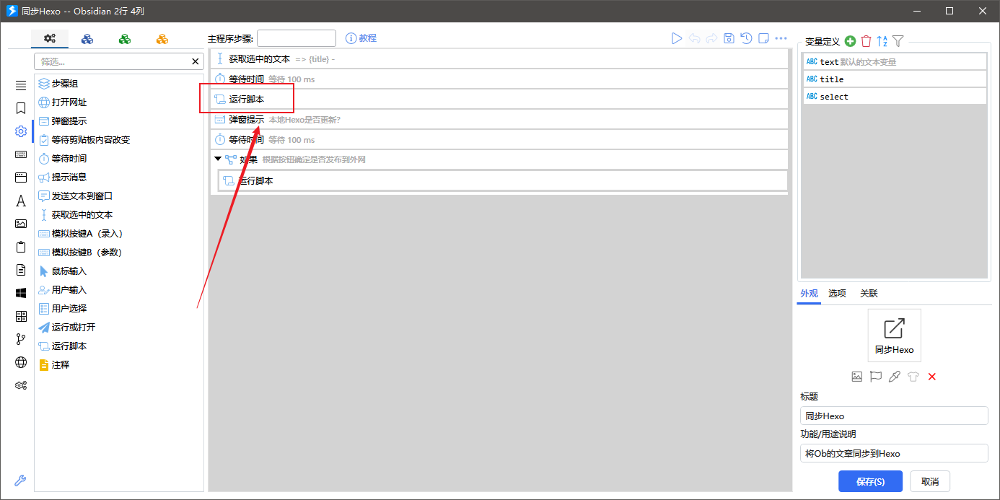

# 项目简介


我目前在使用Obsidian作为我的本地Markdown编辑器，使用Hexo作为个人博客

在Obsidian写文章，需要复制文件到Hexo中去，同时还要修改Front-matter，过程比较麻烦

写个脚本，用于将Obsidian中文章快速部署到博客中去


# 部署


## 安装

>前提已经安装了Hexo、Python，如果没有安装，需要先安装
>
>具体安装方式自行上网查询
>
>还需要安装Quicker（可选），推荐安装，可以更加快捷的发布


下载克隆本仓库

```git
git clone https://github.com/l739217783/Obsidian2Hexo.git
```

或者直接下载


结构如下

```
Obsidian2Hexo
 ├── assets
 │   ├── image-20230116183325452.png
 │   └── image-20230116183414508.png
 ├── Front_matter_edit.py   <------依赖脚本
 ├── Ob2Hexo.py   <------同步脚本
 └── ReadMe.md
```


## 配置脚本

需要先设置下位置

编辑`Ob2Hexo.py`脚本，将其中变量修改成个人使用的对应位置即可

```
Obsidian2Hexo
 ├── assets
 │   ├── image-20230116183325452.png
 │   └── image-20230116183414508.png
 ├── Front_matter_edit.py   
 ├── Ob2Hexo.py   <------
 └── ReadMe.md
```

- `ob_path`：Obsidian库的位置
- `photo_path`：Obsidian库存储图片的位置
- `hexo_path`：Hexo存放文章的位置
- `hexo_photo_path`：Hexo存放图片的位置


## 配置Quicker

有安装Quicker的话，粘贴这个动作

编辑下quicker粘贴的动作，修改下面的运行脚本



将这一行修改成脚本存放的位置

例如脚本存放在C盘，那么就写成`CD C：`即可


# 使用方式


## 脚本同步

如果没有安装Quicker的话，那么直接用脚步同步即可

在`Ob2Hexo.py`所在目录下运行以下命令即可

`xxx`为要同步的文章，不用写后缀`.md`

```Python
python Ob2Hexo.py xxx
```


## Quicker同步

有安装Quicker的话，直接选中要同步的文件标题，运行分享的动作即可

