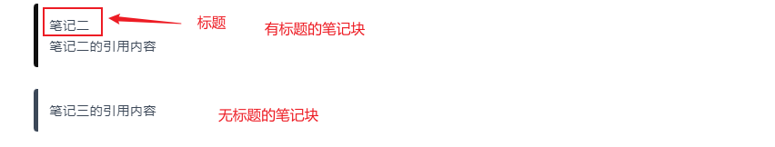
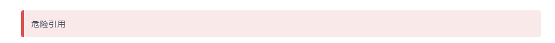
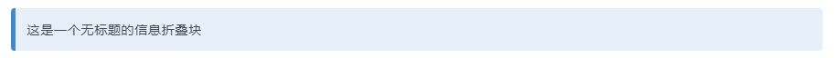
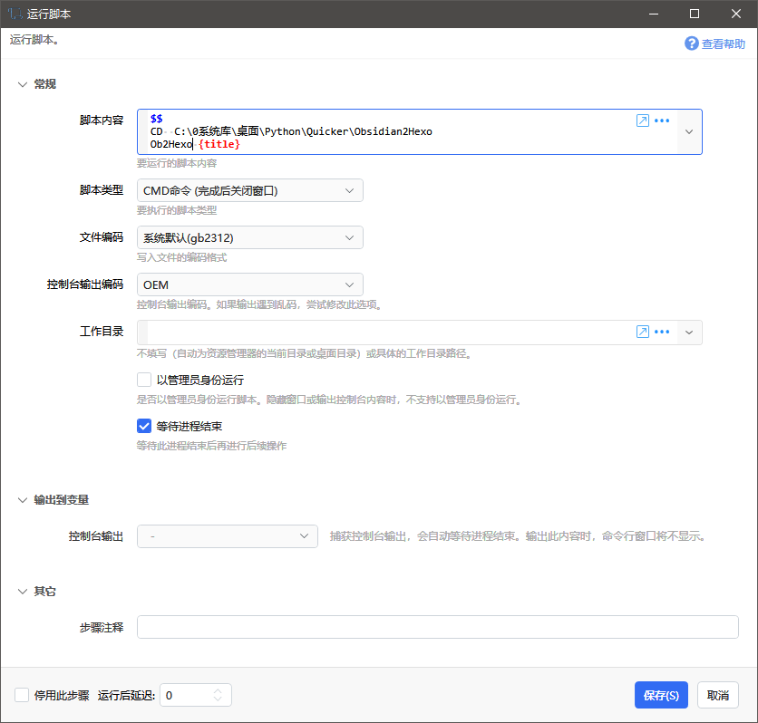
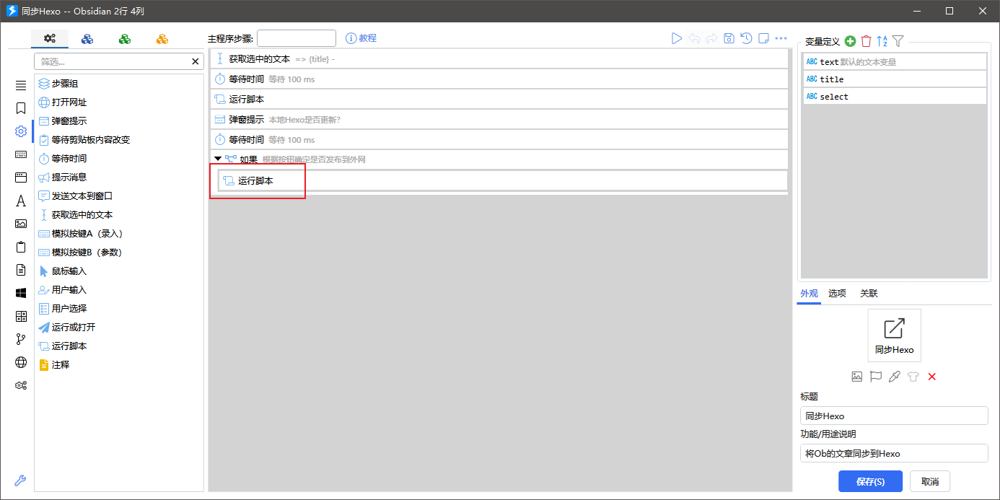
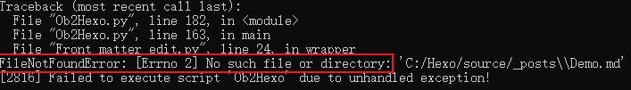

# 项目简介


我目前在使用Obsidian作为我的本地Markdown编辑器，使用Hexo作为个人博客

在Obsidian写文章，需要复制文件到Hexo中去，同时还要修改Front-matter，过程比较麻烦

写个脚本，用于将Obsidian中文章快速部署到博客中去


## 功能

- [x]  文章发布（快速将Obsidian文章发布到Hexo）
  - 脚本发布：`python Ob2Hexo.py xxx`
  - [quicker发布](##Quicker同步)
- [x] callout转换（目前fluid主题支持note、info、danger、warning四种）
  效果图：
  
  
  
  
- [x] 图片支持（发布到Hexo的带有图片的文章，正常显示）
  - 支持图片名写法：``
  - 支持相对路径写法：``
  - 支持绝对路径写法：``
- [ ] 双链支持（待实现）


## 文件结构

结构如下

```
Obsidian2Hexo
 ├── Front_matter_edit.py
 ├── Ob2Hexo.py
 └── setting.json
```

- `Front_matter_edit.py`：依赖脚本，用于提供`Front-matter`的修改

- `Ob2Hexo.py`：同步使用，将Obsidian的文章、图片拷贝到Hexo目录下

- `setting.json`：存储配置信息

  - `ob_path`：Obsidian库的位置

  - `photo_path`：Obsidian库的图片位置
  - `hexo_path`：Hexo站点的目录位置
  - `hexo_photo_path`：Hexo站点的图片位置
  - `rep_dict`：需要替换的Front-matter字段，字典形式，键为要替换的字段，值为替换后的字段

    ```Python
    "name": "title"  #例如，将name换成title
    ```
  - `del_list`：需要删除的Front-matter字段，一些字段，Hexo用不到

    

# 部署


## 安装

>前提已经安装了Hexo、Python，具体安装方式自行上网查询
>
>还需要安装Quicker（可选），推荐安装，可以更加快捷的发布
>
>如果不想安装Python，觉得麻烦，也可以直接使用[免安装同步](##免安装同步)


通过以下方式之一下载

1. 有安装`git`，直接拉取本仓库

   ```
   git clone https://github.com/l739217783/Obsidian2Hexo.git
   ```
2. [Github下载](https://github.com/l739217783/Obsidian2Hexo/releases/tag/v0.1)
3. [阿里云](https://www.aliyundrive.com/s/toS1MobGC17)


## 配置信息

>不管是免脚本同步还是脚本同步均需要设置此配置信息
>
>要不无法使用


编辑`setting.json`，修改对应信息

- `ob_path`：Obsidian库的位置
- `photo_path`：Obsidian库的图片位置
- `hexo_path`：Hexo站点的目录位置
- `hexo_photo_path`：Hexo站点的图片位置

- `rep_dict`：需要替换的Front-matter字段，字典形式，键为要替换的字段，值为替换后的字段

  >需要将front-matter转换下
  >
  >hexo的中的时间字段为：`date`
  >
  >而个人的时间字段为：`date created`
  >
  >所以写成如下
  >
  >```Python
  >{"date created": "data" }
  >```
  >
  >根据个人需要更改

- `del_list`：需要删除的Front-matter字段，一些字段，Hexo用不到（可选，不影响使用）

  


## 配置Quicker

>有安装Quicker阅读，无安装跳过


1. 复制动作
   有安装Quicker的话，复制粘贴这个[动作](https://getquicker.net/Sharedaction?code=a07971ae-343a-478c-e26f-08daf70dc81e&fromMyShare=True)

2. 修改下脚本位置
   编辑下quicker粘贴的动作，修改下面的运行脚本
   

3. **脚本用户**，修改存放位置即可

   将这一行修改成脚本（免安装程序）存放的位置

   例如脚本存放在C盘，那么就写成`CD C：`即可
   

4. **免安装用户**，需要修改成如下

   ```
   $$
   CD  C:\0系统库\桌面\Python\Quicker\Obsidian2Hexo
   Ob2Hexo {title}
   ```

   将第二行改成Ob2Hexo程序的位置
   

5. 默认只同步到本地，如果要分享到外网，需要增加一句`hexo d`

   

   修改成如下即可

   ```
   hexo clean
   hexo g
   hexo d
   ```

   


# 使用方式


## 免安装同步

>适用于未安装Python用户使用

1. 进入`Ob2Hexo.exe`所在目录

2. 按住`Shift`+右键，选择**在此处打开Powershell**
   

3. 输入`.\Ob2Hexo`+要同步的文章即可（不用写后缀`.md`）

   例如，我要同步Demo，就输入：

   ```
   .\Ob2Hexo Demo
   ```

4. 如果文件已存在，会提示是否要覆盖文件，根据个人选择填入选项即可
   


可能遇到的问题

> 如果不是在Obsidian库使用，而是在一个单独的文件夹中使用的话
>
> 如果找不到文章，无法复制到Hexo对应目录下
> 
>
> 可能导致的原因
>
> 1. Obsidian库的位置信息没配置好
>    需要修改`setting.json`文件，将`ob_path`，改为你自己的Obsidian库的位置
> 2. 要同步的文章不在Obsidian库下，放在其他文件夹导致无法同步


## 脚本同步

> 适用于安装Python用户使用


如果没有安装Quicker的话，那么直接用脚步同步即可

在`Ob2Hexo.py`所在目录下运行以下命令即可

`xxx`为要同步的文章，不用写后缀`.md`

```Python
python Ob2Hexo.py xxx
```


## Quicker同步

有安装Quicker的话，

直接选中要同步的文件标题，运行分享的动作即可

演示效果：


